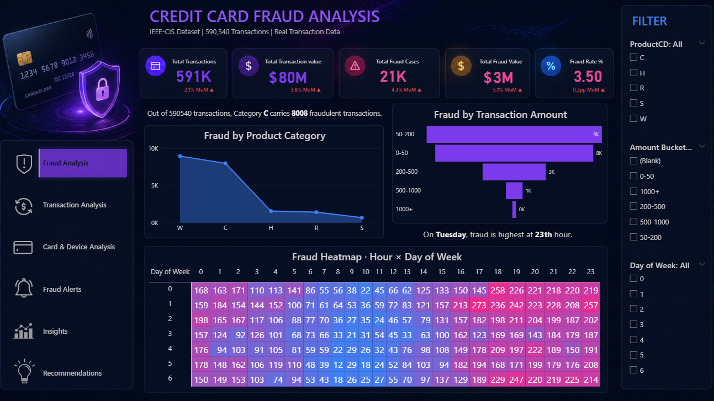
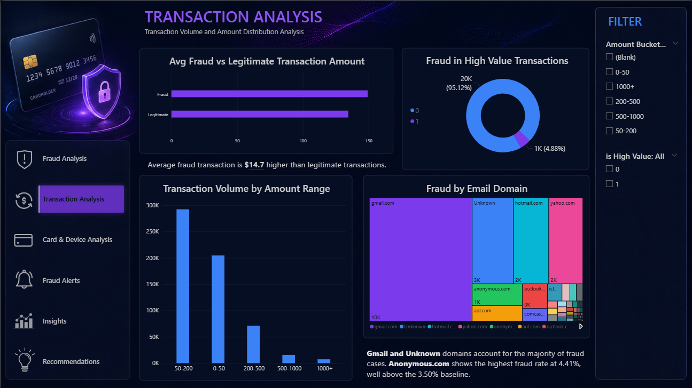
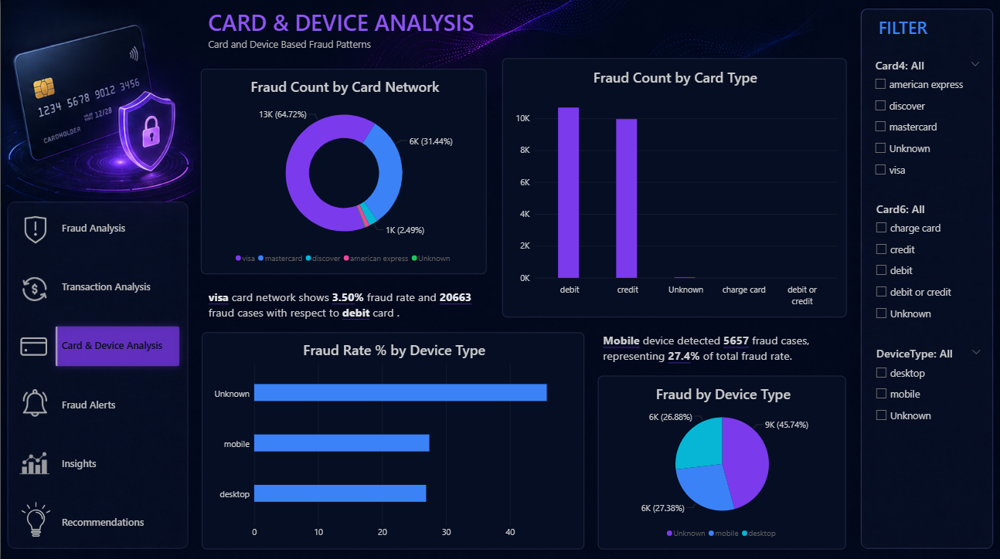
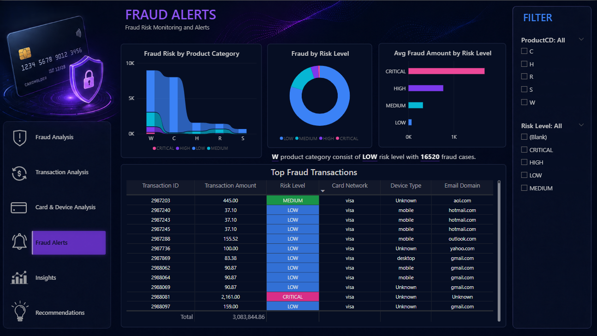
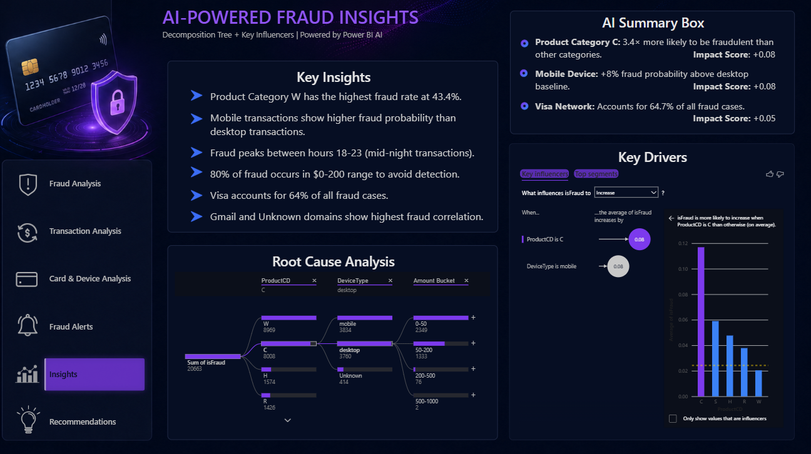
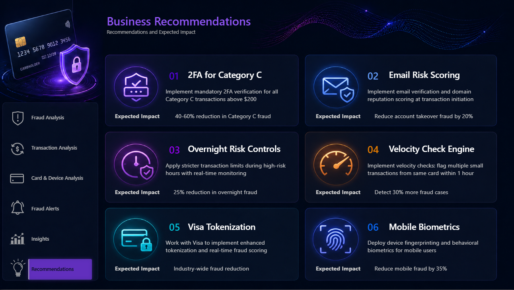

# 🛡️ Credit Card Fraud Detection & Analysis
### End-to-End Data Analytics Project | IEEE-CIS Real Transaction Data

---

## 📌 Project Overview

A complete end-to-end **Credit Card Fraud Detection and Analysis** project built on real transaction data from the **IEEE-CIS Fraud Detection dataset** (Vesta Corporation). The project covers the full analytics pipeline — from raw data ingestion to an interactive business dashboard with AI-powered insights.

> **Dataset:** IEEE-CIS Fraud Detection · 590,540 transactions · Real Vesta Corp data  
> **Fraud Rate:** 3.50% (20,663 fraud cases)  
> **Tools:** Python · PostgreSQL · Power BI · DAX

---

## 🎯 Business Problem

Financial institutions lose billions annually to credit card fraud. This project simulates a real fraud analytics workflow — identifying high-risk patterns, segmenting fraud by product, device, card network, and time — and translating those findings into actionable business recommendations.

---

## 🗂️ Project Architecture

```
IEEE-CIS Dataset (CSV)
        ↓
Python (Pandas + NumPy)
→ Data Cleaning + Feature Engineering
        ↓
PostgreSQL 18
→ 5 Relational Tables + 7 Business Views
        ↓
Power BI Desktop
→ 6-Page Interactive Dashboard
→ Dynamic DAX Measures + AI Visuals
```

---

## 📊 Dashboard Screenshots

### Page 1 — Fraud Analysis


### Page 2 — Transaction Analysis


### Page 3 — Card & Device Analysis


### Page 4 — Fraud Alerts


### Page 5 — AI-Powered Fraud Insights


### Page 6 — Business Recommendations


---

## 🧠 Key Findings

| Finding | Value |
|---------|-------|
| Total Transactions | 590,540 |
| Total Fraud Cases | 20,663 (3.50%) |
| Highest Risk Product | Category C — 11.84% fraud rate (3.4× above baseline) |
| Highest Risk Device | Mobile — +8pp higher fraud probability than desktop |
| Dominant Fraud Network | Visa — 64.72% of all fraud cases |
| Peak Fraud Window | Tuesday · Hour 1 (midnight–1AM) |
| Amount Pattern | 80% of fraud occurs in $0–200 range |
| High Risk Email Domain | Anonymous.com — 4.41% vs 3.50% baseline |
| AI Key Influencer #1 | ProductCD = C → +0.08 fraud probability increase |
| AI Key Influencer #2 | DeviceType = mobile → +0.08 fraud probability increase |

---

## 💡 Business Recommendations

| # | Recommendation | Expected Impact |
|---|---------------|-----------------|
| 1 | 🔐 Mandatory 2FA for Category C transactions > $200 | 40–60% reduction in Cat C fraud |
| 2 | 📧 Email domain reputation scoring at transaction initiation | 20% reduction in account takeover |
| 3 | ⏰ Stricter transaction limits during overnight window (00–06h) | 25% reduction in overnight fraud |
| 4 | ⚡ Velocity checks — flag multiple small transactions within 1hr | 30% more fraud cases detected |
| 5 | 💳 Visa network enhanced tokenization partnership | Industry-wide fraud reduction |
| 6 | 📱 Device fingerprinting + behavioral biometrics for mobile | 35% reduction in mobile fraud |

---

## 🗄️ Database Schema

```
transactions (fact table — 590,540 rows)
    ├── card_info          [1:1] — card network, type, details
    ├── address_info       [1:1] — billing address fields
    ├── identity_info      [1:1] — device type, identity signals
    └── behavior           [1:1] — C-series and D-series signals
```

**7 Business Views Created in PostgreSQL:**

| View | Description |
|------|-------------|
| `vw_fraud_overview` | Single-row KPI summary |
| `vw_fraud_by_product` | Fraud rate by product category |
| `vw_fraud_by_hour` | Temporal fraud pattern (0–23h) |
| `vw_fraud_by_amount` | Fraud by transaction amount bucket |
| `vw_fraud_by_device` | Fraud by device type |
| `vw_fraud_by_card` | Fraud by card network and type |
| `vw_fraud_by_day` | Fraud by day of week |

---

## 📈 DAX Measures Used

```dax
-- Core KPIs
Total Fraud = SUM(transactions[isFraud])
Fraud Rate % = DIVIDE(SUM(transactions[isFraud]), COUNT(transactions[TransactionID])) * 100
Avg Fraud Amount = CALCULATE(AVERAGE(transactions[TransactionAmt]), transactions[isFraud] = 1)

-- Dynamic Insight Measures
Top Fraud Category = IF(ISFILTERED(transactions[ProductCD]),
    SELECTEDVALUE(transactions[ProductCD], "W"), "W")

Top Fraud Day Name = CALCULATE(SELECTEDVALUE('By Day'[day_name]),
    TOPN(1, SUMMARIZE('By Day', 'By Day'[day_name],
    "FraudCount", SUM('By Day'[fraud_count])), [FraudCount], DESC))

Device Fraud Rate % = DIVIDE(SUM(transactions[isFraud]),
    COUNT(transactions[TransactionID])) * 100

Selected Network Fraud Rate % = DIVIDE(SUM(transactions[isFraud]),
    COUNT(transactions[TransactionID])) * 100
```

---

## 🛠️ Tools & Technologies

| Layer | Tool | Purpose |
|-------|------|---------| 
| Data Processing | Python 3.14 · Pandas · NumPy | Cleaning, feature engineering |
| Database | PostgreSQL 18 · pgAdmin 4 | Relational storage, business views |
| Connectivity | psycopg2 | Python–PostgreSQL connection |
| Visualization | Power BI Desktop | 6-page interactive dashboard |
| AI Features | Power BI Key Influencers + Decomposition Tree | Automated fraud driver analysis |
| Custom Visual | Advance Card (AppSource) | Enhanced KPI cards |
| Version Control | Git + GitHub | Code and documentation |

---

## 📁 Repository Structure

```
Credit-Card-Fraud-Detection/
│
├── 📓 fraud_detection_analysis.ipynb    # Complete Python data pipeline
├── 📄 README.md                          # Project documentation
│
├── sql/
│   ├── create_tables.sql                # PostgreSQL schema (5 tables)
│   └── create_views.sql                 # Business views (7 views)
│
└── Pages/
    ├── P1.png                            # Fraud Analysis page
    ├── P2.png                            # Transaction Analysis page
    ├── P3.png                            # Card & Device Analysis page
    ├── P4.png                            # Fraud Alerts page
    ├── P5.png                            # AI Insights page
    └── P6.png                            # Business Recommendations page
```
---

## 👩‍💻 Author

**Shambhavi Shailendra Kshirsagar**  
Data Analyst | Power BI · Python · SQL · PostgreSQL  
🔗 [LinkedIn](https://linkedin.com/in/shambhavi-kshirsagar) · [GitHub](https://github.com/shambhavi-kshirsagar)

---

*Dataset: [IEEE-CIS Fraud Detection](https://www.kaggle.com/competitions/ieee-fraud-detection) · Vesta Corporation · Kaggle*
